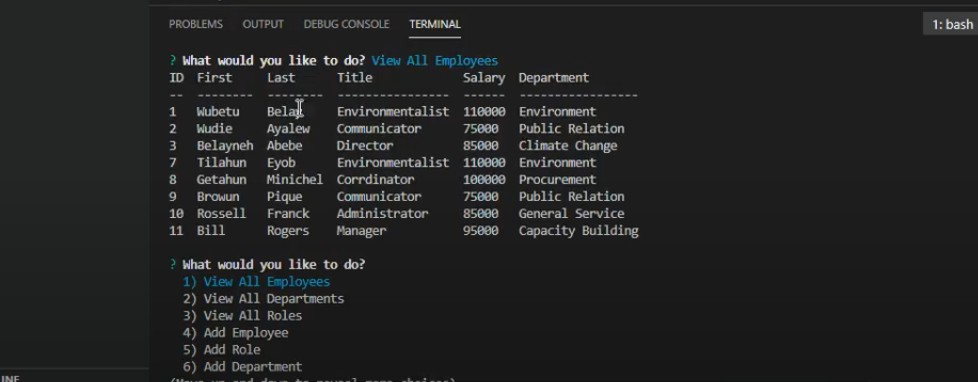
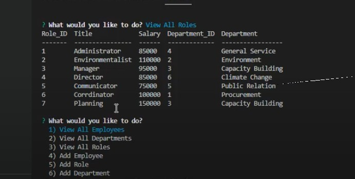

# Employee-Tracker

## Table of Content
- [Description](#description)
- [Motivation](#motivation)
- [Instructions](#instructions)
- [Usage](#usage)
- [Guidelines](#guidelines)
- [Test instruction](#test-instruction)
- [Lesson learned](#lesson)
- [Acknowledgement](#acknowledgement)
- [Question](#question)
## Description 

This application is an employee tracker. It can help any organization to view, update, and delete employees, thier role and department when necessary. It is designed to incorporate as much as the users demands. For example if the user wants to incorporate his 100 emplyes and thier roles and departments in the database and can update when necessery. It will accomodate as much as they want. It is time saving, easy and can be refactored if necessary. The application designed by joining employee, their role and departments. If needed it is possible to widen it as much as needed. To develop this application, I used HTML, CSS, Javascript,  npm packages and other technologies.  

## Motivation 

Now a days the way of informaion management is highly migrated from manual to digital form. 

## Instructions

You do not have a limitation to use this application. it is an open source. If you already have the above specified tools you can use this application. First right click on the index.js file and click on ‘open on integrated terminal’ or you can use a terminal and drag or write the file inside opened terminal. If it is going well as attached in the screenshot foldor install the npm in the terminal. When the installation is completed type node index.js and hit the enter button. following that the questions going to prompt and write your answer for each question. If you face any problem or would like to reach me, you can find my contact in the question section. 

## Usage 

This application is working properly. You can see  a link of walkthrough video and a few screen shots for demonstration under test instruction section.

## Guidelines: 

Try to read and watch relevant materials, tutorials in addition to the markdown guide!

## Test instruction 

I checked the application for many times, and it works well, and you can watch the walkthrough video. 

You can click on the following link to see the walkthrough video:https://drive.google.com/file/d/1ETgE5laXORdedFW4FbBiq0I8-Aq4zAo9/view

GitHub URL: https://github.com/bayleyegn100/Employee-Tracker

## Lesson-learned

I got some take away like how and when to use the inquirer to import modules, fs to write files. In addition through this process I learned how to use and its importance of .gitignore file incorporating the necessery independacies.

## Acknowledgement

The instructor, my tutor, online information providers like google, you tube and others.  

## Question

Here is a link to my Github profile: (http://github.com/bayleyegn100)

If you have any questions you can reach me via E-mail: bayleyegn100@gmail.com 

